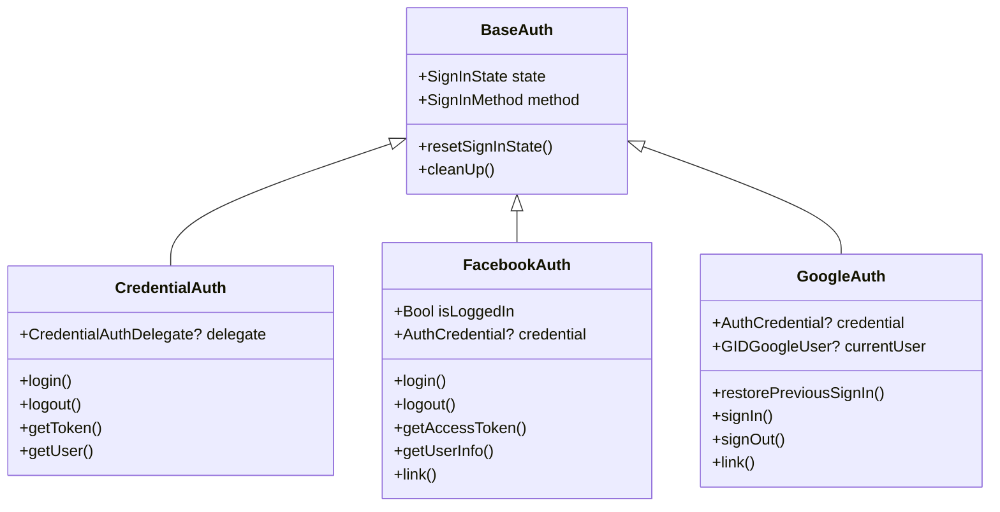

# iOS Authentication

This repository includes a collection of classes for handling authentication in iOS applications. It includes implementations for Facebook, Google and standard email/password authentication.

### [CredentialAuth](CredentialAuth/README.md)

CredentialAuth is a Swift package that provides a simple way to handle authentication and token management.

### [FacebookAuth](FacebookAuth/README.md)

A simple and efficient Swift library for Facebook Login in iOS. The class makes use of the FirebaseAuth and Facebook Login SDK for iOS to provide a user-friendly and customizable sign-in experience, while handling the authentication process in the background.

### [GoogleAuth](GoogleAuth/README.md)

GoogleAuth is a convenient and secure way to sign in to your iOS application using Google credentials. This library is built on top of FirebaseAuth and the Google Sign-In SDK for iOS.
